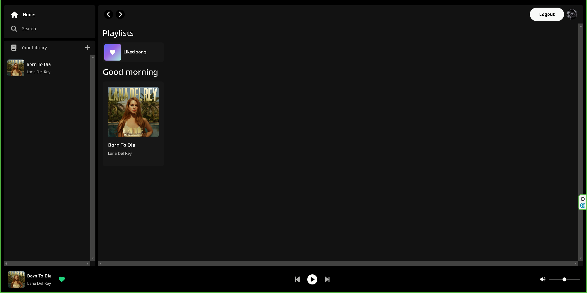
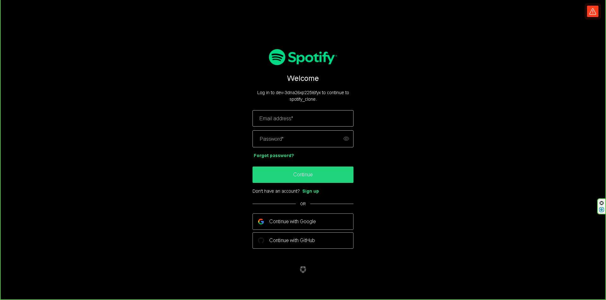

# Clone de Spotify (Fullstack) avec Spring boot 3, Angular 17, Bootstrap 5, PostgreSQL, Auth0(Backend)

Spring boot backend of the spotify clone

[Angular Frontend](https://github.com/1auti/spotify-clone-frontend)





### Key Features :
- 🔐 Security with Auth0 (OAuth2)
- 🎶➕ Music Upload
- 🎧 Audio Streaming
- 🔍 Search Function
- ❤️ User Favorites
- 📱💻 Responsive UI with Bootstrap
- 🅰️ Latest Angular Features: Signal, Standalone Component, New Control Flow Syntax

## Usage
### Prerequisites
- [JDK 21](https://adoptium.net/temurin/releases/)
- IDE (VS code, IntelliJ)
- [PostgreSQL](https://www.postgresql.org/download/)

### Clone the repository
``git clone https://github.com/C0de-cake/spotify-clone-back``

### Setup .env file
Create a .env file at the root of the project
````
POSTGRES_USERNAME= 
POSTGRES_PASSWORD=
POSTGRES_URL=
POSTGRES_DB=

AUTH0_CLIENT_ID=
AUTH0_CLIENT_SECRET=
````

### Fetch the dependencies
``./mvnw install -Dmaven.test.skip=true``

### Launch
Go in IntelliJ add .env file to the environment variables and then run it
